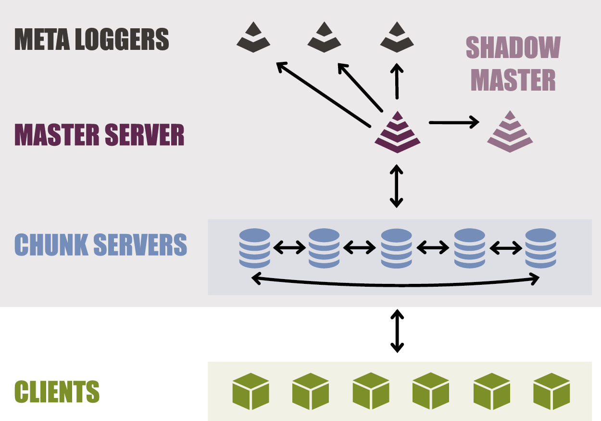

# Lizardfs Administration

LizardFS is a highly reliable, scalable and efficient distributed file system. It spreads data over a number of physical servers, making it visible to an end user as a single file system.

Here is a short handbook on lizardfs cluster configuration. 
## Architecture
<p align="center">
  
</p>


## The /etc/hosts file
```bash 
<ip-address>   <hostname> <alias>
```

Example:
```bash
127.0.0.1        localhost
192.168.16.100   mfsmaster
192.168.16.101   shadowmaster
192.168.16.10    chunkserver1 metalogger
192.168.16.11    chunkserver2 cgiserver
192.168.16.12    chunkserver3
```

## ```service status check```
 ```bash
service lizardfs-master status
service lizardfs-chunkserver status
service lizardfs-metalogger status
 ```